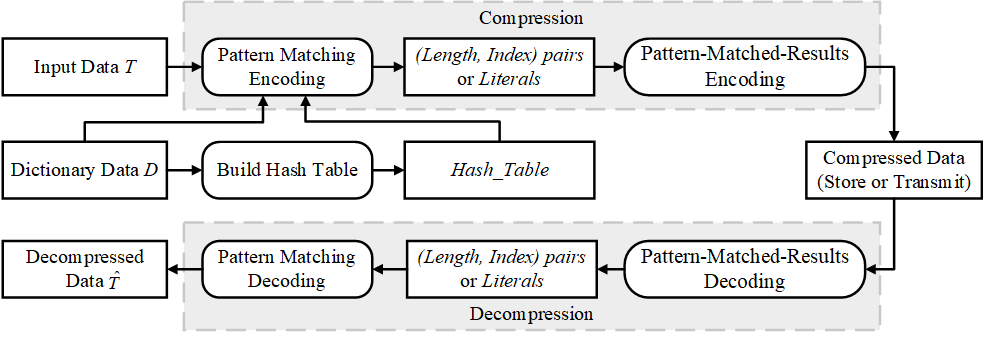

## This code is for paper:

 "PatMatchCom: A Pattern Matching-Based Error-Bounded Compression Algorithm for High-Frequency Time Series".



<p align="center"><b>fig 4. Overview of PatMatchCom</b></p>

## Instructions for Using PatMathCom

### 1.Dependencies

This project requires the **Brotli** library. Install it based on your operating system:

#### 1.1 Linux

```sh
sudo apt install libbrotli-dev
```

#### 1.2 Windows

You can install **Brotli** using the package manager **vcpkg**:

```sh
vcpkg install brotli:x64-windows
```


### 2. Build the Project

#### 2.1 Linux

```sh
git clone https://github.com/zhongshunji/PatMatchCom.git
cd PatMatchCom
cmake -B build
cmake --build build
```

#### 2.2 windows

```sh
git clone https://github.com/zhongshunji/PatMatchCom.git
cd PatMatchCom
# -DCMAKE_TOOLCHAIN_FILE= specifies the toolchain file provided by vcpkg, Replace this path with the correct location of "vcpkg.cmake" in your system
cmake -B build -DCMAKE_TOOLCHAIN_FILE=D:\anzhuang\Vcpkg\vcpkg\scripts\buildsystems/vcpkg.cmake
cmake --build build
```


###  3. Split the Dataset

Run the Python script `split_datasets.py` to divide the dataset into **Dictionary Data (D)** and **Input Data (T)**:

```sh
cd datasets
python split_datasets.py
```


### 4. Compression and Decompression Commands

#### 4.1 Compression Command Format:

```sh
./PatMathCom -c [Dictionary Data] [Input Data] [Error Bound Mode] [Error Bound]
```

Parameter Explanation:

- **[Dictionary Data]**: The dictionary dataset file (a single-column CSV file). 
- **[Input Data]**: The input dataset file (a single-column CSV file).
- **[Error Bound Mode]**: Specifies the mode of the error bound:
  - `A`: Absolute error bound.
  - `R`: Relative error bound.
- **[Error Bound]**: The maximum allowable error.

#### 4.2 Decompression Command Format:

```sh
./PatMathCom -d [Dictionary Data] [Compressed Data]
```


### 5.Examples:

#### Compression with Absolute Error Bound:

``` sh
# Using RSSI-2_D.csv as dictionary data to compress input data RSSI-2_T.csv with maximum allowed absolute error of 5, obtaining compressed data RSSI-2_T.bin.
./PatMatchCom   -c    RSSI-2_D.csv   RSSI-2_T.csv    A    5
./PatMatchCom   -d    RSSI-2_D.csv   RSSI-2_T.bin
# Using RSSI-2_D.csv as dictionary data to decompress the compressed data RSSI-2_T.bin.

./PatMatchCom   -c    MIT-ECG_D.csv   MIT-ECG_T.csv     A    0.04
./PatMatchCom   -d    MIT-ECG_D.csv   MIT-ECG_T.bin

./PatMatchCom   -c    S3-XYZ_D.csv   S3-XYZ_T.csv     A    0.01
./PatMatchCom   -d    S3-XYZ_D.csv   S3-XYZ_T.bin

./PatMatchCom   -c    KPI-0_D.csv   KPI-0_T.csv    A    0.1
./PatMatchCom   -d    KPI-0_D.csv   KPI-0_T.bin

./PatMatchCom   -c    Wafer_D.csv   Wafer_T.csv     A    0.1
./PatMatchCom   -d    Wafer_D.csv   Wafer_T.bin

./PatMatchCom   -c    Wine_D.csv   Wine_T.csv     A    0.02
./PatMatchCom   -d    Wine_D.csv   Wine_T.bin
```

#### Compression with Relative Error Bound:

``` sh
# Using RSSI-2_D.csv as dictionary data to compress input data RSSI-2_T.csv with maximum allowed relative error of 16%, obtaining compressed data RSSI-2_T.bin.
./PatMatchCom   -c    RSSI-2_D.csv   RSSI-2_T.csv    R    0.16
./PatMatchCom   -d    RSSI-2_D.csv   RSSI-2_T.bin

./PatMatchCom   -c    MIT-ECG_D.csv   MIT-ECG_T.csv     R    0.15
./PatMatchCom   -d    MIT-ECG_D.csv   MIT-ECG_T.bin

./PatMatchCom   -c    S3-XYZ_D.csv   S3-XYZ_T.csv     R    0.22
./PatMatchCom   -d    S3-XYZ_D.csv   S3-XYZ_T.bin

./PatMatchCom   -c    KPI-0_D.csv   KPI-0_T.csv    R    0.25
./PatMatchCom   -d    KPI-0_D.csv   KPI-0_T.bin

./PatMatchCom   -c    Wafer_D.csv   Wafer_T.csv     R    0.25
./PatMatchCom   -d    Wafer_D.csv   Wafer_T.bin

./PatMatchCom   -c    Wine_D.csv   Wine_T.csv     R    0.25
./PatMatchCom   -d    Wine_D.csv   Wine_T.bin
```
